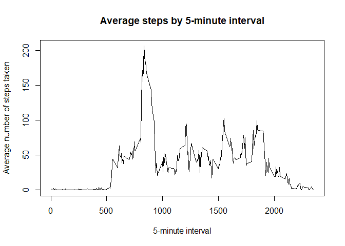

by B. Schuurman

Setup global options:


``` r
knitr::opts_chunk$set(echo = TRUE)
```


## Loading and preprocessing the data


``` r
data <- read.csv("activity.csv")
head(data)
```

```
##   steps       date interval
## 1    NA 2012-10-01        0
## 2    NA 2012-10-01        5
## 3    NA 2012-10-01       10
## 4    NA 2012-10-01       15
## 5    NA 2012-10-01       20
## 6    NA 2012-10-01       25
```

## What is mean total number of steps taken per day?


``` r
# Calculate the total number of steps taken per day
day_steps <- aggregate(steps ~ date, data = data, FUN = sum, na.rm = TRUE)

# display the total number of steps taken per day
print(day_steps)
```

```
##          date steps
## 1  2012-10-02   126
## 2  2012-10-03 11352
## 3  2012-10-04 12116
## 4  2012-10-05 13294
## 5  2012-10-06 15420
## 6  2012-10-07 11015
## 7  2012-10-09 12811
## 8  2012-10-10  9900
## 9  2012-10-11 10304
## 10 2012-10-12 17382
## 11 2012-10-13 12426
## 12 2012-10-14 15098
## 13 2012-10-15 10139
## 14 2012-10-16 15084
## 15 2012-10-17 13452
## 16 2012-10-18 10056
## 17 2012-10-19 11829
## 18 2012-10-20 10395
## 19 2012-10-21  8821
## 20 2012-10-22 13460
## 21 2012-10-23  8918
## 22 2012-10-24  8355
## 23 2012-10-25  2492
## 24 2012-10-26  6778
## 25 2012-10-27 10119
## 26 2012-10-28 11458
## 27 2012-10-29  5018
## 28 2012-10-30  9819
## 29 2012-10-31 15414
## 30 2012-11-02 10600
## 31 2012-11-03 10571
## 32 2012-11-05 10439
## 33 2012-11-06  8334
## 34 2012-11-07 12883
## 35 2012-11-08  3219
## 36 2012-11-11 12608
## 37 2012-11-12 10765
## 38 2012-11-13  7336
## 39 2012-11-15    41
## 40 2012-11-16  5441
## 41 2012-11-17 14339
## 42 2012-11-18 15110
## 43 2012-11-19  8841
## 44 2012-11-20  4472
## 45 2012-11-21 12787
## 46 2012-11-22 20427
## 47 2012-11-23 21194
## 48 2012-11-24 14478
## 49 2012-11-25 11834
## 50 2012-11-26 11162
## 51 2012-11-27 13646
## 52 2012-11-28 10183
## 53 2012-11-29  7047
```

``` r
# 2. Make a histogram of the total number of steps taken each day, using Scott's rule
hist(day_steps$steps, 
     main = "Histogram of total number of steps per day", 
     xlab = "Total number of steps", 
     ylab = "Frequency",
     breaks = "Scott")
```

<!-- -->

``` r
# 3. Calculate mean and median total daily steps
mean_steps <- mean(day_steps$steps)
median_steps <- median(day_steps$steps)

cat("Mean of the total number of steps taken each day:", mean_steps, "\n")
```

```
## Mean of the total number of steps taken each day: 10766.19
```

``` r
cat("Median of the total number of steps taken each day:", median_steps, "\n")
```

```
## Median of the total number of steps taken each day: 10765
```


## What is the average daily activity pattern?


``` r
# Calculate average steps by interval, ignoring missing values
interval_avg <- aggregate(steps ~ interval, data = data, FUN = mean, na.rm = TRUE)

# Make a time series plot of the 5-minute interval (x-axis) and the average number of steps taken, averaged across all days (y-axis)
plot(interval_avg$interval, interval_avg$steps, 
     type = "l", 
     main = "Average steps by 5-minute interval",
     xlab = "5-minute interval", 
     ylab = "Average number of steps taken")
```

<!-- -->

``` r
# Identifying and displaying which 5-minute interval, on average across all the days in the dataset, contains the maximum number of steps
max_interval <- interval_avg[which.max(interval_avg$steps), ]
# display the total number of steps taken per day
cat("This 5-minute interval, on average across all the days in the dataset, contains the maximum number of steps:", max_interval$interval, "\n")
```

```
## This 5-minute interval, on average across all the days in the dataset, contains the maximum number of steps: 835
```

``` r
cat("with how may average steps?:", round(max_interval$steps, 2), "\n")
```

```
## with how may average steps?: 206.17
```

So which 5-minute interval, on average across all the days in the dataset, contains the maximum number of steps? 835
with 206.17 average steps

## Imputing missing values


``` r
#Calculate and report the total number of missing values in the dataset
missing_values_count <- sum(is.na(data$steps))
cat("Total number of missing values:", missing_values_count, "\n")
```

```
## Total number of missing values: 2304
```

``` r
#My strategy for imputing data is using the mean steps for each 5-minute interval, which we calculated before. Now we create a new dataset with the imputed values
activity_imputed <- data
for (i in 1:nrow(activity_imputed)) {
  if (is.na(activity_imputed$steps[i])) {
    interval_value <- activity_imputed$interval[i]
    activity_imputed$steps[i] <- interval_avg$steps[interval_avg$interval == interval_value]
  }
}

# Checking if there are no more missings
cat("Missing values after imputation:", sum(is.na(activity_imputed$steps)), "\n")
```

```
## Missing values after imputation: 0
```

I'm showing a histogram of the total number of steps taken each day and the mean and median total number of steps taken per day. Do these values differ from the estimates from the first part of the assignment? What is the impact of imputing missing data on the estimates of the total daily number of steps? We can see this if we compare it in a simple table.


``` r
#calculate and report the mean and median total number of steps taken per day for the imputed dataset
daily_steps_imputed <- aggregate(steps ~ date, data = activity_imputed, FUN = sum)
mean_imputed <- mean(daily_steps_imputed$steps)
median_imputed <- median(daily_steps_imputed$steps)

# Histogram of total steps (imputed data)
hist(daily_steps_imputed$steps, 
     main = "Histogram of total number of steps taken each day - Imputed data", 
     xlab = "Total number of steps taken each day", 
     ylab = "Frequency", 
     breaks = "Scott")
```

<!-- -->

``` r
#report the mean and median total number of steps taken per day for the imputed dataset
cat("Mean of the total number of steps taken each day in the imputed dataset:", mean_imputed, "\n")
```

```
## Mean of the total number of steps taken each day in the imputed dataset: 10766.19
```

``` r
cat("Median of the total number of steps taken each day in the imputed dataset:", median_imputed, "\n")
```

```
## Median of the total number of steps taken each day in the imputed dataset: 10766.19
```

``` r
# Create comparison table
comparison_table <- data.frame(
  Measure = c("Mean", "Median"),
  Original = c(mean_steps, median_steps),
  Imputed = c(mean_imputed, median_imputed)
)
print(comparison_table)
```

```
##   Measure Original  Imputed
## 1    Mean 10766.19 10766.19
## 2  Median 10765.00 10766.19
```


## Are there differences in activity patterns between weekdays and weekends?


``` r
#put to English locale cause I'm not
Sys.setlocale("LC_TIME", "C")
```

```
## [1] "C"
```

``` r
# 'date' in Date format
activity_imputed$date <- as.Date(activity_imputed$date)

# make 'day_type'
activity_imputed$day_type <- ifelse(
  weekdays(activity_imputed$date) %in% c("Saturday", "Sunday"), 
  "weekend", 
  "weekday"
)

# convert 'day_type' to factor
activity_imputed$day_type <- factor(activity_imputed$day_type, levels = c("weekday", "weekend"))

# check 'day_type'
print(table(activity_imputed$day_type))  # both weekday and weekend have data
```

```
## 
## weekday weekend 
##   12960    4608
```

``` r
# aggregate
avg_steps <- aggregate(steps ~ interval + day_type, data = activity_imputed, FUN = mean)

# check aggregated
print(head(avg_steps))
```

```
##   interval day_type      steps
## 1        0  weekday 2.25115304
## 2        5  weekday 0.44528302
## 3       10  weekday 0.17316562
## 4       15  weekday 0.19790356
## 5       20  weekday 0.09895178
## 6       25  weekday 1.59035639
```

``` r
# plot
par(mfrow = c(2, 1), mar = c(4, 4, 2, 1))

# weekday plot
weekday_data <- subset(avg_steps, day_type == "weekday")
plot(
  weekday_data$interval, weekday_data$steps, type = "l", col = "blue",
  xlab = "Interval", ylab = "Number of steps", main = "weekday"
)

# weekend plot
weekend_data <- subset(avg_steps, day_type == "weekend")
plot(
  weekend_data$interval, weekend_data$steps, type = "l", col = "blue",
  xlab = "Interval", ylab = "Number of steps", main = "weekend"
)
```

<!-- -->

